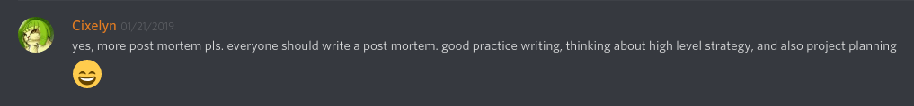
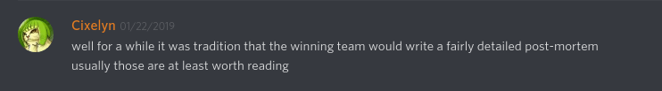
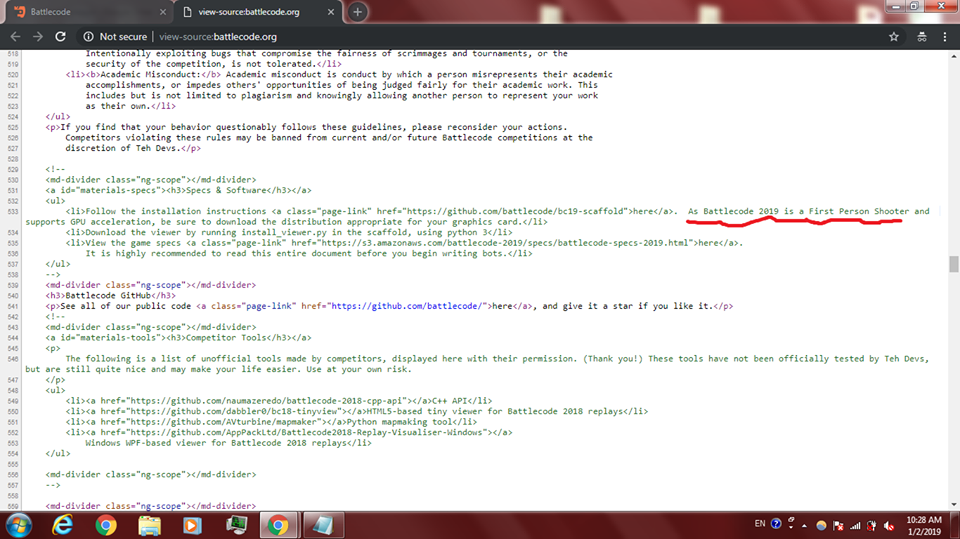

# 2950 lines of Javascript AI - An MIT Battlecode 2019 Writeup

[Editing in Progress... (Last Update: 3/12)]

2019: CitricSky - 3rd place (Finalists)\
2018: CitricSky - Top 16 (Finalists)\
2017: ANinjaz - Top 48/64\
<sub><sup>All placings concern the main bracket (and not the high school bracket)</sup></sub>

### Introduction - Why did I write this?

It's that time of the year again! A month-long constant grind to achieve the invaluable experience of travelling to MIT and glorious fame of (owait there is prize money too ;o) winning against the top minds of the world. For the past few years, I have participated in Battlecode, but I had never written any sort of writeup. It was only until Cixelyn (Cory Li, MIT 2012), a previous winner of battlecode (and also wrote a fascinating blog post [link here](https://cory.li/battlecode-intro/)), protested that we should write more post mortems.





Quite frankly, I simply did not have anything interesting to write about in previous years, and thus did not pursue any sort of writeup. However, this year, although we (spoilers) did not win, it certainly has been an adventurous journey in not only programming our bot, but also in socializing with the devs, sponsors, and other teams at the finals.

### Initial Preparation

Coming into my third year of MIT Battlecode, I was motivated to make this year our best performance yet. One of my current philosophy in these competitions is to always strive for #1. Decisions should be made with the goal of reaching first place instead of the "I should cut my losses" mindset. In addition, it is important for me to pursue long term learning goals that pertain to the real world. As a high school student, I realized that it is not a time for me to make products or start a company and save the world from global warming or achieve world peace at this age. After all, there are over 7 billion people in the world and a great majority have more experience than I do. Certainly there are a significant number of people that are smarter in many areas than I am, so how would I be able to solve worldly problems as a measly high school student? Therefore, I sought to use Battlecode as a focus on education, learning tools and ideas that can prepare me to solve these problems for the future.

I was preparing myself for the four-week grind over MIT's Independent Activities Period long before it actually started. One thing that I heard about was from last year's #1 team Orbitary Graph (Side note: I also talked to Standard Technology during the finals, and they also considered using something similar based off an open source project a previous battlecoder (bovard) had created: https://github.com/bovard/archon). Orbitary Graph had a "battlestation" where they could have bots play other versions of their bots automagically. Rule based (handcoded non-machine-learning) bots often have many "magic values" used for heuristics. Having this battlestation can produce fast, convenient, and reliable results to assist in creating a more fluid feedback loop to help change constants. Unfortunately, even if I knew about bovard's archon project beforehand, it would not have been easily adaptable to the new Javascript stack used in Battlecode 2019.


Since [Halite III](https://halite.io) (a different AI competition), I wanted to "Bot Arena" that had a very similar concept to the Battlecode battlestation. Along with automatically running matches, this Bot Arena would also implement a trueskill leaderboard that mirrors Halite's leaderboard. (Side note: In retrospect, a trueskill leaderboard would never have been efficient in Battlecode 2019 due to the amount of computation power it takes to run one game.) With familiarity with Java, Python, and similar languages, I had reasonable experience with backend tools - the key experience I lacked was creating a frontend. Therefore, I spent a few days in November/December musing over front-end frameworks such as ReactJS (Side tangent here: I actually got an introduction to ReactJS earlier at [MIT's ESP](https://esp.mit.edu/learn/index.html) program. I would highly recommend middle and high school students to explore MIT's ESP courses with a friend or two for fun). While exploring front-end, I started to wonder what frontend frameworks other simple websites used. What better website than Battlecode itself?
	
That's when I started scrolling through the source of the website. It was then I stumbled across a particularly interesting comment:




Battlecode was going to be an first person shooter o.0

(By the way, the website uses Angular)

Anyways, when the competition rolled around, in turns out it was not any sort of first person shooter. So whatever dev that left that comment trolled us. As for the battlestation/bot arena, I never got around to finishing it due to the college application process :(.

### Sprint Tournament - Initial Infrastructure

Armed with our experience from previous years, we knew that we could not compete against other people in theorycrafting based off the specs. Therefore, we took an approach similar to what we learned from last year: Building infrastructure. Thankfully, we did not have to go to the extent of wrapping their entire API before starting our actual strategies.

Our first big infrastructural decision was deciding what language to use. Battlecode 2019's engine is based off Javascript and transpilation into Javascript. Although none of our team members had any sort of experience with building a large project in Javascript, we decided we did not want to deal with the disadvantages of using transpiled Java or Python:

* Debugging would be a pain - One would have to read transpiled Javascript
    * Eventually, we did figure out line numbers do correspond with compiled_bot.js, which was very useful because the compiled version closely matched when using pure javascript.
* Not something we could foresee, but jsweet's transpiler online service went down in the middle of the competition, causing many teams not be able to transpile their Java code.
* I wanted to learn javascript anyways

Otherwise, there are two other notable pieces of infrastructure we built during our first week.

* WrappedController - robot_map, true_map, map
    * Original purpose of keeping track of castles and churches for deposit locations of pilgrims
    * Treated a unit staying in the same location for 2 turns as "impassable terrain"
        * Explained in the "Navigation" section
    * Transposing (because y, x is confusing for me :S)
        * Had a very confusing bug where it seemed like one of the maps was transposed
            * Turns out we were transposing every turn because the maps do not get reset every turn (they do not change from the start)
* [Dijkstras](https://en.wikipedia.org/wiki/Dijkstra%27s_algorithm) (and soon after [BFS](https://en.wikipedia.org/wiki/Breadth-first_search)) - stopCondition (and soon after ignoreCondition)
    * PriorityQueue implementation (Heap)
        * Used [Binary Heap](https://en.wikipedia.org/wiki/Binary_heap) implementation
    * We did not time out because most, if not all, runs stop search early (stopCondition) when they find what they wanted
        * Includes finding church locations (Pilgrims)
        * Finding path towards enemy castle (Combat Units)
        * Finding path to and from resources (Pilgrims)

### Sprint Tournament - Strategy & Macro Game

Initial Inspection

When we read the specs, our initial impression was that the team that made use of give() the best would have a resource advantage, and thus win the long game. This was because give() was the only free (0 fuel cost) way of transporting resources. One could chain many units from the castle to each of the resources, as if it was some sort of [min-cost flow problem](https://en.wikipedia.org/wiki/Minimum-cost_flow_problem). However, not only would this require an extensive infrastructure of code, it also never got viable due to the large initial costs, especially after the buffed churches.

Navigation

As shown above, a primary piece of infrastructure we built were pathfinding algorithms, Dijkstras and BFS. However, these algorithms in its vanilla form have a difficult time dealing with moving "barriers" (which are actually just other units). If one just simply consider all of the other units as impassable terrain, a unit could not travel through a 1-wide tunnel without waiting for the first unit to pass, because it would imagine the tunnel to be completely blocked. Yet, if we considered all units to be passable, a unit could be trying to go into a location where there's another unit is simply sitting there, waiting for the enemy to attack. We decided to take a simple approach, considering all units to be passable until they are detected to be not moving, in which they would be considered as impassable. This worked well enough throughout the competition, and possesses the advantage of not incurring explicit communication costs.

Castle Centralization

* Everything is centralized on one castle (referred to as the "leader castle")
* Pilgrims are assigned to resource tiles by the leader castle
* Defenders (which are only prophets at this stage) are assigned to resource tiles by the leader castle

[TODO]

Communication System

Battlecode 2019's communication was particularly restrictive - the only free (explicit) communication was known as "castle talk." One could treat it as units being able to write 8 bit memory per turn where only the castles can read. This makes castles a candidate to be used for centralization. However, we quickly noted the fatal flaw that castle talk by itself does not allow for any form of two way communication. Using only castle talk would be virtually impossible to coordinate units and create a cohesive bot (unless you use a substantial amount of emergent behavior).

To coordinate more units, we need to figure out some form of two way communication. This requirement leads to the only other form of communication: signalling. Unfortunately, transmitting over long distances takes a tremendous amount of fuel (proportional to r^2 where r is the distance). However, a short transmission to an adjacent tile (r = 1, r = 2) would only require a maximum of 4 fuel. It just so happens that build restrictions require new units to be always adjacent to the unit that built them. Therefore, it makes sense to take advantage of this by always sending a signal when we build a new unit. The new unit can then queue up the free castle talks to communicate back to the centralized castles.

### Sprint Tournament - Reflection

Why did we scrap (majority of) this plan?

Many people say those that ultimately win the tournament often do not do well in the Sprint tournament. This is because those that do well in the final tournament usually have some kind of infrastructure that can more easily adapt to whatever the current meta is. Our first week was planned to be primarily focused on infrastructure, but it is important to be careful not to spiral too deep into microoptimizing this infrastructure and not have time to code your strategy at all. After all, [premature optimization is the root of all evil](http://wiki.c2.com/?PrematureOptimization).

With that in mind, we ultimately never intended our Sprint Tournament Strategy to be our final strategy; we only started drafting this plan two days before the sprint tournament deadline.

All of this talk can boil down to one question: What makes a good Battlecode bot? 
[TODO]

### Seeding/Qualifiers/Finals Strategy

Defender's Advantage

After they nerfed rushes by allowing castles to attack, everybody quickly realized that turtling has an inherent advantage due to the inability to move and attack all in one turn. Assuming that both the attacker and defender has the same attack range (which is often the case with prophets vs prophets), a unit has to step in the enemy's attack range in order to attack. The enemy then gets a free attack, causing one to lose the 1 vs 1 engagement. Therefore, in order to win micro, one has to either coordinate their attacker units so they have a local numbers advantage, or simply sit and defend to wait for enemies to walk in your vision radius.

Lattice prophets

Scrimming against other teams, someone came up with the idea of creating a lattice of units. Originally, a "lattice" was simply surrounding a pilgrim with 4 prophets on the subcardinal directions. The pilgrim is then still able to move about and deposit the resource it mined to churches and castles.

[Insert Image]

However, because units can jump over other units this year (most units have movement range to be r^2 <= 4), people quickly realized they could simply build a lattice everywhere and not just near pilgrims. We quickly deducted that the primary purpose of this lattice is to claim territory, and still allow other units to freely traverse wherever they want. Because units can move diagonally, one can create a checkerboard pattern:

[Insert Image]

People started referring this as the "Sparse Lattice"

Why prophets? Prophets have the highest attack range

Sparse vs Dense

[TODO]

With movement range to be r^2 <= 4, we can actually pack our units tighter to 3/4 space efficiency (over the 1/2 space efficiency of the standard checkboard pattern). The standard sparse lattice is simply checking whether `(x + y) % 2 == 0`, but we can switch to a sparse lattice simply by adding another OR statement. Dense lattice's formula is `(x + y) % 2 == 0 || x % 2 == 0`.

[Insert Dense Lattice Image]

Our team's initial reaction was dense lattices are obviously better than sparse lattices. After all, they could defend territory with greater efficiency. However, evaluating this in further detail, we realized there was a tradeoff: territory control. [TODO]

Distributing the lattice

Our goal is to expand our lattices from all churches and castles, as those are the locations that need to be protected. However, because not all church and castle locations are equal, if one were to always build a prophet if they had enough resources, the lattice can grow unevenly. Therefore, we wanted some sort of counter for each location keeping track how big the lattice is so far, and only grow if the lattice is smaller or equal to all the other lattices. [TODO]

### Seeding/Qualifiers

Kiting of (lattice) prophets

[TODO]

### Seeding/Qualifiers/Finals Strategy - Communication (again)

[TODO]

Identification system

One really only has to identify as a unit type once - then one can use a map that maps id to unit type
Did not get around to implementing this for the qualifiers or finals

[TODO]

### Seeding Tournament - Castle Timeouts

ChurchLocationFinder

One of the key concepts in our strategy is determining where and what order churches should be built. Due to the defenders strategy, combat units (prophets, crusaders, preachers) do not traverse to new areas to "explore." Instead, we have a predefined order of church locations that we calculate at the beginning of the game.

Scrimming vs Standard Technology, we realized they prioritized church locations that were near the middle before they occupied resources on their own side. Unfortunately, we did not get around to doing the same thing, as it would probably require some kind of arbitrary scoring system that did not seem to be worth our time.

Once we reached the seeding tournament, we realized our bot kept doing unexplainable actions. It seems like a lot of our units were timing out for no apparent reason, causing our bot to lose and end up with a terrible seed for the qualifying tournament. After the tournament, we quickly scrambled to investigate what was going on - it turns out, although our Big O notation of ChurchLocationFinder was okay, it had a large constant, resulting in timeouts. Fortunately, with the new announcement of no edge cases in the map generator, we were comfortable with optimizing the constant factor (commits [6294a34](https://github.com/awesomelemonade/Battlecode2019/commit/6294a34a0c7126043b3bd9626fa213515560194c) and [4326864](https://github.com/awesomelemonade/Battlecode2019/commit/4326864ad071335b2c78a2036a96fe2096f032b8)). At this point, we were thinking we might've screwed ourselves out of qualifying for the finals tournament, but we were determined to push through the rough road ahead of us.

### Qualifiers

Church Laser

* Many teams realized they could abuse the turn queue. When one creates a unit, the unit get appended at the end of the turn queue. Theoretically, if one keeps building units in the same turn, they can traverse the map by creating units without enemy intervention. [TODO]

Crusader Endgame Spam

When the Crusader buff came out, we had an intuition that it wasn't enough to be viable. However, after reconsidering and careful analysis, we realized there were two main benefits that could potentially make them useful.

* Prophets take more fuel to kill a crusader than it takes for crusaders to be built (40 fuel vs 15 fuel). This could be useful if we're in a stalemate

* Crusaders have the highest karbonite to unit health ratio, making them the best unit to spam during the endgame when trying to be efficient with karbonite.

[TODO]

Last minute Crusader Endgame Spam adjustment (filling a sparse lattice into a dense lattice with crusaders)

[TODO]

### Qualifiers - MIT BeaverWorks

When we qualified for the finals, one of the finalists private messaged me congratulating us. At first, I was very confused, but to my surprise, it turns out they were friends I met over the summer from MIT BeaverWorks. [TODO]

Ian and Denver on team Unlimited

### High School Bracket

Knights of Cowmelot (howrusogood), Unlimited, Deus Vult

smite + Panda Lovers (Producing Perfection) graduated last year

### Final tournament

* [Final Tournament Bracket](https://challonge.com/bc_19_finals)

* Emergent Behavior

https://www.twitch.tv/mitbattlecode/clip/IntelligentAnnoyingAsteriskKlappa

* Our first matchup vs Justice Of The War

https://www.twitch.tv/mitbattlecode/clip/GoldenFrozenAsparagusYee

### Final Tournament - Ideas I heard I wish I could of implemented

* Centralization of lattice structure onto castles: [WhaleVomit (Hi Lawrence!)](https://github.com/WhaleVomit) on Knights of Cowmelot said they assigned prophets to lattice locations, so if they detect the prophet dies, they can avoid sending another prophet there. This would have conserved a lot of resources and prioritized claiming unclaimed land over fighting a stalemate prophet battle.

### Conclusion

[TODO]

Thank you to devs, sponsors, and everybody that made this competition possible!

```
Final line count:
    50 Bfs.js
   657 CastleBot.js
   348 ChurchBot.js
   195 ChurchLocationFinder.js
   331 CrusaderBot.js
    59 Dijkstras.js
   157 LatticeProphetBot.js
    92 Library.js
   185 PilgrimBot.js
    18 PreacherBot.js (unused)
    70 PriorityQueue.js
   197 ProphetBot.js (unused)
    83 robot.js
    80 UnitsTracker.js
   335 Util.js
    93 WrappedController.js
  2950 total
```
